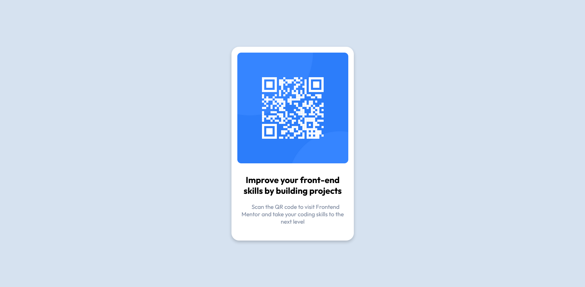

# Frontend Mentor - QR code component solution

This is a solution to the [QR code component challenge on Frontend Mentor](https://www.frontendmentor.io/challenges/qr-code-component-iux_sIO_H). Frontend Mentor challenges help you improve your coding skills by building realistic projects. 

## Table of contents

  - [Screenshot](#screenshot)
  - [Links](#links)
  - [Built with](#built-with)

### Screenshot
#### Desktop

#### Mobile

### Links

- [Live Site URL](https://radiant-conkies-73a422.netlify.app/)

### Built with

- Semantic HTML5 markup
- CSS custom properties

